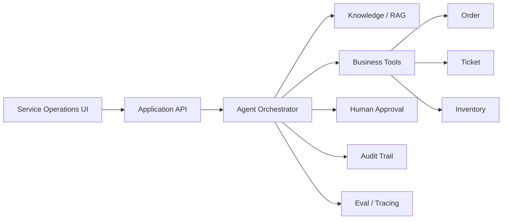

# 飞梭 Flyweave

> **让 AI 穿过系统，抵达结果。**

**Flyweave** 是一个面向企业服务场景的智能体工作流平台（Enterprise Agentic Workflow Platform）。它连接企业知识、订单、工单、业务工具与人工审批，让 AI 从“回答问题”进一步走向“完成业务动作”。

Flyweave 的第一条落地链路聚焦售后与客户服务，但产品目标不是再做一个聊天机器人，而是验证一套可迁移到企业真实工作流中的 Agent 方法：**理解 → 检索 → 调用工具 → 判断 → 审批 → 执行 → 审计 → 评估**。

## Why Flyweave

传统企业软件完成了“流程数字化”，但真正的查询、判断、跨系统操作和异常处理仍大量依赖人工。

普通 AI Chatbot 通常止步于“给答案”。Flyweave 关注的是下一步：

- AI 能否读取正确的企业知识与业务上下文；
- AI 能否安全地调用订单、工单等业务工具；
- 高风险动作能否进入人工审批，而不是盲目自动化；
- 每一次 Agent Run 能否被追踪、审计、复盘和评估；
- 最终能否用真实指标衡量效率、成本与可靠性。

## MVP · One Golden Path

首个 MVP 只跑通一条完整业务链，不扩张成通用 Agent 平台：

```text
Ticket
  ↓
Understand request
  ↓
Retrieve policy / knowledge
  ↓
Query order tool
  ↓
Make a constrained decision
  ↓
Risk check
  ↓
Human approval (when required)
  ↓
Execute business action
  ↓
Write back ticket / CRM
  ↓
Audit + Eval
```

### Example

用户提交：

> 我的耳机右耳没有声音，7 月 12 日购买，可以换货吗？

Agent 需要完成：

1. 识别为“质量问题 / 换货”工单；
2. 检索售后政策；
3. 查询订单购买时间与状态；
4. 查询库存；
5. 根据规则形成处理建议；
6. 高风险或低置信度场景进入人工审批；
7. 审批通过后调用业务工具创建换货单；
8. 写回工单并记录完整执行轨迹。

## MVP Contract

Flyweave 使用一套刻意保持轻量的执行契约来约束 AI 辅助开发，避免 MVP 演变成通用平台：

- [`spec.md`](specs/001-service-agent-mvp/spec.md) — 产品事实、Golden Path、功能需求、验收标准与明确非目标
- [`plan.md`](specs/001-service-agent-mvp/plan.md) — 技术方案、领域模型、Tool 边界、审批与审计设计
- [`tasks.md`](specs/001-service-agent-mvp/tasks.md) — T001–T030 可执行任务，映射 GitHub Issues #1–#5

原则：**Outcome over chat. Thin vertical slice over platform breadth. Real execution over impressive simulation.**

## Core Capabilities

- **Agent Workflow** — 将复杂服务流程拆成可观察、可恢复的执行步骤
- **RAG / Context Engineering** — 从企业知识中获取有依据的上下文
- **Tool Calling** — 连接订单、库存、工单等业务能力
- **Human-in-the-loop** — 对高风险动作保留人工控制权
- **RBAC / Tool Permission** — 限制 Agent 能看到什么、能执行什么
- **Audit Trail** — 记录关键输入、判断、工具调用和人工操作
- **Eval & Tracing** — 评估正确性、工具选择、成本、延迟和失败原因
- **Failure Recovery** — 对超时、工具失败、低置信度结果进行恢复或升级

## Product Surface

MVP 优先做三个界面：

1. **Service Operations** — 工单、自动化率、人工接管率、成本与风险概览
2. **Agent Runs** — 展示一次任务从理解到执行的完整 Timeline
3. **Approval Inbox** — 人工审批高风险 Agent Action，并保留审计记录

## Architecture



更详细的边界与设计见 [`docs/MVP_SCOPE.md`](docs/MVP_SCOPE.md) 与 [`docs/ARCHITECTURE.md`](docs/ARCHITECTURE.md)。

## Planned Stack

> 技术栈服务于业务闭环，不为了展示技术而自造基础设施。

- **Frontend:** Vue 3 + TypeScript
- **Backend:** Python + FastAPI
- **Database:** PostgreSQL
- **Agent orchestration:** 优先成熟组件，按 MVP 需求选择
- **Retrieval:** PostgreSQL / pgvector 或等价成熟方案
- **Observability / Eval:** 优先接入成熟 tracing / eval 能力

## Product Principles

1. **Outcome over chat** — 目标是完成工作，不是增加聊天窗口。
2. **Thin vertical slice** — 先跑通一条真实链路，再扩展能力。
3. **Human control by default** — 高风险动作默认可审、可拦、可回滚。
4. **Observable by design** — Agent 每一步都应该能够解释和追踪。
5. **Buy before build** — 通用能力优先复用成熟方案，不重复造轮子。
6. **Business value is measurable** — 自动化率、处理时间、失败率、成本都应可量化。

## Roadmap

当前阶段：**MVP / Scope Locked**

- [ ] Product shell + mock service data
- [ ] End-to-end happy path
- [ ] Business tool calling
- [ ] Human approval
- [ ] Audit trail
- [ ] Knowledge retrieval
- [ ] Eval / tracing
- [ ] Failure recovery
- [ ] Demo polish & case study

详细实施顺序见 [`docs/ROADMAP.md`](docs/ROADMAP.md)。

## Demo Data Notice

项目早期展示数据均为 **Demo / Simulation Data**，用于验证产品与工程方案，不代表真实企业生产指标。

---

**Flyweave / 飞梭** — *Let AI move through systems and reach outcomes.*
