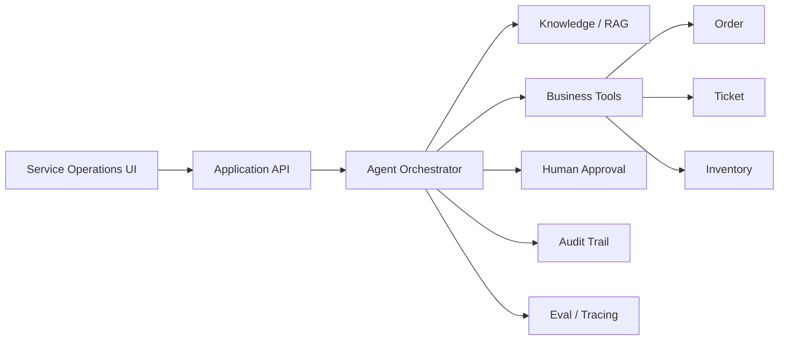

# 飞梭 Flyweave

> **让 AI 穿过系统，抵达结果。**

**Flyweave** 是一个面向企业服务场景的智能体工作流平台（Enterprise Agentic Workflow Platform）。它连接企业知识、订单、工单、业务工具与人工审批，让 AI 从“回答问题”进一步走向“完成业务动作”。

Flyweave 的第一条落地链路聚焦售后与客户服务，但产品目标不是再做一个聊天机器人，而是验证一套可迁移到企业真实工作流中的 Agent 方法：**理解 → 检索 → 调用工具 → 判断 → 审批 → 执行 → 审计 → 评估**。

## Why Flyweave

传统企业软件完成了“流程数字化”，但真正的查询、判断、跨系统操作和异常处理仍大量依赖人工。

普通 AI Chatbot 通常止步于“给答案”。Flyweave 关注的是下一步：

- AI 能否读取正确的企业知识与业务上下文；
- AI 能否安全地调用订单、工单等业务工具；
- 高风险动作能否进入人工审批，而不是盲目自动化；
- 每一次 Agent Run 能否被追踪、审计、复盘和评估；
- 最终能否用真实指标衡量效率、成本与可靠性。

## MVP · One Golden Path

首个 MVP 只跑通一条完整业务链，不扩张成通用 Agent 平台：

```text
Ticket
  ↓
Understand request
  ↓
Retrieve policy / knowledge
  ↓
Query order tool
  ↓
Make a constrained decision
  ↓
Risk check
  ↓
Human approval (when required)
  ↓
Execute business action
  ↓
Write back ticket / CRM
  ↓
Audit + Eval
```

### Example

用户提交：

> 我的耳机右耳没有声音，7 月 12 日购买，可以换货吗？

Agent 需要完成：

1. 识别为“质量问题 / 换货”工单；
2. 检索售后政策；
3. 查询订单购买时间与状态；
4. 查询库存；
5. 根据规则形成处理建议；
6. 高风险或低置信度场景进入人工审批；
7. 审批通过后调用业务工具创建换货单；
8. 写回工单并记录完整执行轨迹。

## MVP Contract

Flyweave 使用一套刻意保持轻量的执行契约来约束 AI 辅助开发，避免 MVP 演变成通用平台：

- [`spec.md`](specs/001-service-agent-mvp/spec.md) — 产品事实、Golden Path、功能需求、验收标准与明确非目标
- [`plan.md`](specs/001-service-agent-mvp/plan.md) — 技术方案、领域模型、Tool 边界、审批与审计设计
- [`tasks.md`](specs/001-service-agent-mvp/tasks.md) — T001–T030 可执行任务，映射 GitHub Issues #1–#5

原则：**Outcome over chat. Thin vertical slice over platform breadth. Real execution over impressive simulation.**

## Core Capabilities

- **Agent Workflow** — 将复杂服务流程拆成可观察、可恢复的执行步骤
- **RAG / Context Engineering** — 从企业知识中获取有依据的上下文
- **Tool Calling** — 连接订单、库存、工单等业务能力
- **Human-in-the-loop** — 对高风险动作保留人工控制权
- **RBAC / Tool Permission** — 限制 Agent 能看到什么、能执行什么
- **Audit Trail** — 记录关键输入、判断、工具调用和人工操作
- **Eval & Tracing** — 评估正确性、工具选择、成本、延迟和失败原因
- **Failure Recovery** — 对超时、工具失败、低置信度结果进行恢复或升级

## Product Surface

MVP 优先做三个界面：

1. **Service Operations** — 工单、自动化率、人工接管率、成本与风险概览
2. **Agent Runs** — 展示一次任务从理解到执行的完整 Timeline
3. **Approval Inbox** — 人工审批高风险 Agent Action，并保留审计记录

## Architecture



更详细的边界与设计见 [`docs/MVP_SCOPE.md`](docs/MVP_SCOPE.md) 与 [`docs/ARCHITECTURE.md`](docs/ARCHITECTURE.md)。

## Planned Stack

> 技术栈服务于业务闭环，不为了展示技术而自造基础设施。

- **Frontend:** Vue 3 + TypeScript
- **Backend:** Python + FastAPI
- **Database:** PostgreSQL
- **Agent orchestration:** 优先成熟组件，按 MVP 需求选择
- **Retrieval:** PostgreSQL / pgvector 或等价成熟方案
- **Observability / Eval:** 优先接入成熟 tracing / eval 能力

## Product Principles

1. **Outcome over chat** — 目标是完成工作，不是增加聊天窗口。
2. **Thin vertical slice** — 先跑通一条真实链路，再扩展能力。
3. **Human control by default** — 高风险动作默认可审、可拦、可回滚。
4. **Observable by design** — Agent 每一步都应该能够解释和追踪。
5. **Buy before build** — 通用能力优先复用成熟方案，不重复造轮子。
6. **Business value is measurable** — 自动化率、处理时间、失败率、成本都应可量化。

## Roadmap

当前阶段：**MVP / Scope Locked**

- [ ] Product shell + mock service data
- [ ] End-to-end happy path
- [ ] Business tool calling
- [ ] Human approval
- [ ] Audit trail
- [ ] Knowledge retrieval
- [ ] Eval / tracing
- [ ] Failure recovery
- [ ] Demo polish & case study

详细实施顺序见 [`docs/ROADMAP.md`](docs/ROADMAP.md)。

## Development · 本地开发

以下命令均从仓库根目录执行。Windows 使用 Git Bash（本机为 `D:/Git/bin/bash.exe`），不需要先激活虚拟环境。

### 首次安装

需要 Node.js 18+ / npm 9+、Python 3.11+ 和 PostgreSQL。使用下述容器方案时，先启动 Docker Desktop（Linux containers）。前端使用 npm workspace + `package-lock.json`；后端使用 pip + `apps/api/requirements.txt`，没有 Poetry / uv 配置。

```bash
cd /d/VSCode/fly-weave
npm ci
python -m venv .venv
.venv/Scripts/python.exe -m pip install -r apps/api/requirements.txt
# 仅在没有本机配置时复制；不要覆盖已有凭据
if [ ! -f apps/api/.env ]; then cp apps/api/.env.example apps/api/.env; fi
```

Linux/macOS 将 Python 路径换为 `.venv/bin/python`；npm 开发入口自动选择对应平台路径。应用与 Alembic 始终读取 `apps/api/.env`，进程环境变量优先。不要把凭据提交到 Git。默认开发数据库为 `127.0.0.1:5432/flyweave_dev`，`API_PORT` 保持 `8000`。启动 Approval Inbox 不需要模型 API key、Redis 或 pgvector 服务。

### 数据库

项目当前没有 Dockerfile / Compose；现有方式是独立的 `postgres:16` 容器。本机已有 `flyweave-postgres`，映射 `127.0.0.1:5432 -> 5432`，数据卷为 `flyweave_pgdata`。**不要重复创建或删除已有容器/数据卷**。

仅在全新环境、容器不存在时，使用与 `.env.example` 匹配的本地示例配置创建：

```bash
docker run -d --name flyweave-postgres \
  -e POSTGRES_USER=flyweave \
  -e POSTGRES_PASSWORD=devpassword \
  -e POSTGRES_DB=flyweave_dev \
  -p 127.0.0.1:5432:5432 \
  -v flyweave_pgdata:/var/lib/postgresql/data \
  postgres:16
```

这些凭据仅供本地示例；如自行修改，必须同步修改 `apps/api/.env`。PostgreSQL 容器环境变量只在空数据卷上初始化用户与数据库，改变环境变量不会重设已有卷的密码。使用其他已有 PostgreSQL 服务时，只需提供能连接到已有数据库的 `DATABASE_URL`。

```bash
npm run dev:db       # 检查配置的连接；不可达时尝试 docker start flyweave-postgres
npm run dev:migrate  # 必须：通过已有 Alembic 机制执行 upgrade head
# 可选：仅用于迁移完成、业务表为空的全新开发数据库
npm run dev:seed
```

原生数据库启动命令为 `docker start flyweave-postgres`。迁移文件在 `apps/api/migrations/versions`，当前 head 为 `0011`。不要用 create_all 替代迁移；仅健康检查成功不代表 schema 已初始化。

**Seed 不是启动必需项**：无数据时 Approval API 返回 `[]`，页面显示真实 empty state。原有 `seed_data.py` 会先清除 demo 数据，所以 `dev:seed` 增加空库检查，拒绝覆盖已有记录；`dev:all` 永远不会运行 seed。已有示例数据无需再次初始化。

Seed 创建工单、订单、库存和政策材料，不直接创建审批。需要演示审批时，可在空列表页面点击“运行示例高风险工单”，由真实后端创建 Run 和审批记录。

### 日常启动

```bash
npm run dev:all
```

此入口依次检查/启动数据库、应用迁移、启动 backend、启动 frontend，并检查真实审批 API 和 CORS。它只自动迁移本机 development 数据库，不清库、不 seed，不引入额外进程管理依赖。已运行的本仓库 Vite / Flyweave API 会被复用；若全部已运行，检查成功后命令退出。Ctrl+C 只停止本次命令启动的服务，复用的服务和数据库保留运行。Vite 固定使用 3000，端口占用时明确失败，不静默换到 3001。

也可分别运行（backend 和 frontend 各占一个终端）：

| 用途 | 根目录命令 | 底层入口 |
| --- | --- | --- |
| 数据库 | `npm run dev:db` | 已有 PostgreSQL / `docker start flyweave-postgres` |
| 迁移 | `npm run dev:migrate` | 在 apps/api 执行 `python -m alembic upgrade head` |
| 后端 | `npm run dev:api` | 在 apps/api 用根目录 .venv 执行 `python main.py` |
| 前端 | `npm run dev:web` | `npm run dev -w @flyweave/web` → Vite |
| 整体检查 | `npm run dev:check` | health、Approval API、两个本地来源的 CORS、前端 |

为兼容原有用法，**`npm run dev` 仍只启动前端**；完整启动请使用 `npm run dev:all`。

后端的原生 Git Bash 命令（仓库根目录）：

```bash
.venv/Scripts/python.exe apps/api/main.py
# 等价的显式 uvicorn 入口：
(cd apps/api && ../../.venv/Scripts/python.exe -m uvicorn main:app --reload --host 127.0.0.1 --port 8000)
```

FastAPI 实例位于 `apps/api/main.py` 的 `app = FastAPI(...)`。`python main.py` 读取 API_HOST / API_PORT；uvicorn CLI 的监听地址由 CLI 参数决定。前端当前直接访问 `http://localhost:8000`，没有 Vite proxy 或 VITE_API_URL 配置。CORS 允许 `http://localhost:3000` 和 `http://127.0.0.1:3000` 的 GET/POST。

### 如何确认启动成功

```bash
npm run dev:check
curl -fsS http://localhost:8000/health
curl -fsS http://localhost:8000/approval-requests
```

打开 <http://localhost:3000/approvals>（或 <http://127.0.0.1:3000/approvals>）：

- API 返回 HTTP 200 数组；空数组对应“当前没有待审批操作”，这是正常的真实后端空态。
- 页面没有 `Demo Mode · Sample scenarios` 或“审批服务暂时不可用”提示。
- 浏览器 Network 中对 `http://localhost:8000/approval-requests` 的 GET 成功且无 CORS 错误。
- 有记录时数据来自 PostgreSQL；持久化记录的 `is_demo_data=true` 只是示例业务数据标记，不等于前端在 backend unavailable 时使用的 Demo fallback。

`/health` 不查询数据库，必须同时检查 `/approval-requests`，不能只看页面顶部状态。

### 常见故障

- 只有前端：使用 `dev:all`，或在另一终端执行 `dev:api`。
- 数据库连接失败：检查 Docker Desktop、`docker ps -a`、`docker logs flyweave-postgres`、`DATABASE_URL` 的主机/端口/数据库/凭据，尤其是覆盖 .env 的进程环境变量。
- 表或字段不存在：执行 `npm run dev:migrate`。
- 端口被占用：Git Bash 中执行 `netstat -ano | grep LISTENING`，核对 PID 所属应用，不要盲目杀进程。2026-08-31 实测：3000 为本仓库 Vite、8000 为 API（启动前无监听）、5432 为 PostgreSQL 容器映射；55432 没有监听，不是当前 Flyweave 数据库端口。
- API 健康但前端 fallback：检查实际 Approval API 返回码/结构、CORS 与前端请求地址。本地保持 3000/8000；修改后端端口不会自动更新前端硬编码地址。

## Demo Data Notice

项目早期展示数据均为 **Demo / Simulation Data**，用于验证产品与工程方案，不代表真实企业生产指标。

---

**Flyweave / 飞梭** — *Let AI move through systems and reach outcomes.*
