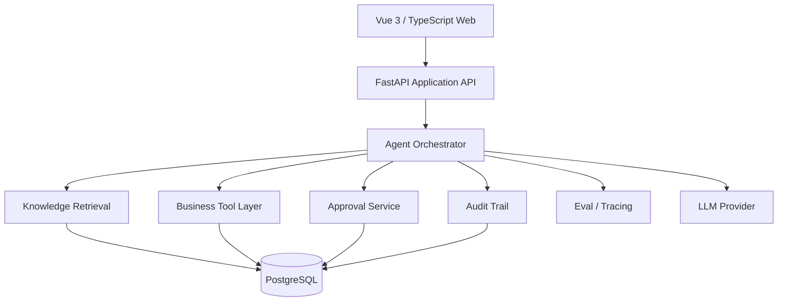

# Flyweave Architecture

## Architecture Goal

Flyweave 的架构目标不是“先进”，而是让企业 Agent 在真实业务约束下做到：

- 能理解上下文；
- 能调用受控工具；
- 能在高风险节点停下来；
- 能恢复长任务；
- 能被追踪、审计和评估；
- 能用最小复杂度跑通完整业务链。

## Logical Architecture



## Bounded Components

### 1. Web / Service Operations UI

职责：

- 工单与运营概览；
- Agent Run timeline；
- Approval Inbox；
- 失败与人工接管状态展示；
- Demo 指标与审计记录可视化。

不负责：

- Agent 编排规则；
- 业务权限判定；
- Prompt 拼装；
- Tool 真实执行逻辑。

### 2. Application API

职责：

- 对 Web 提供稳定 API；
- 鉴权/身份上下文的 MVP 入口；
- 工单、Run、Approval 等资源查询；
- 启动/恢复 Agent Run。

### 3. Agent Orchestrator

职责：

- Run state；
- workflow step；
- structured output；
- tool selection；
- retry / timeout；
- confidence / risk gate；
- pause / resume；
- 生成 trace metadata。

约束：

- 不直接访问数据库业务表；
- 通过 Tool Layer 获取和修改业务数据；
- 高风险 Action 必须经过策略检查和人工审批。

### 4. Knowledge Retrieval

职责：

- 售后政策检索；
- 返回带来源的上下文；
- 最小化无关 Context；
- 为 grounded decision 提供证据。

MVP 不追求复杂 RAG 平台，优先简单、可评估的检索链路。

### 5. Business Tool Layer

首批 Tool：

- `get_order`
- `check_inventory`
- `create_replacement`
- `update_ticket`

每个 Tool 必须：

- 有明确输入 schema；
- 校验参数；
- 有权限/风险边界；
- 返回结构化结果；
- 写入 Tool Call / Audit 记录；
- 失败时返回可恢复错误，而不是模糊字符串。

### 6. Approval Service

职责：

- 创建 approval request；
- 保存 requested action 与关键证据；
- 支持 approve / reject；
- 审批后恢复原 Agent Run；
- 审批操作进入 Audit Trail。

### 7. Audit Trail

至少记录：

- run started / completed / failed；
- decision summary；
- tool requested / succeeded / failed；
- approval requested / approved / rejected；
- business action executed；
- human override。

### 8. Eval / Tracing

MVP 评估重点：

- intent correctness；
- policy grounding；
- tool selection correctness；
- unsafe action blocked；
- final outcome correctness；
- latency / cost / tool failure。

## Suggested Data Model

核心实体：

```text
Ticket
Order
OrderItem
Inventory
Policy
AgentRun
AgentStep
ToolCall
Approval
AuditEvent
EvalCase
EvalResult
```

优先保持 schema 可读，不提前做高度抽象的 workflow schema。

## Execution State

建议将一次 Run 明确建模为状态机，而不是一条不可恢复的 request：

```text
queued
→ running
→ waiting_for_approval
→ running
→ completed

or

→ failed_recoverable
→ retrying
→ completed / failed
```

## Safety Boundary

MVP 中所有有副作用的 Tool 默认视为风险操作。

至少遵守：

1. LLM 不能绕过 Tool schema；
2. LLM 不能直接写数据库；
3. 高风险动作必须经过 deterministic policy gate；
4. Demo 不接真实支付、退款或外部生产系统；
5. 所有关键动作可审计。

## Build-vs-Buy Rule

优先复用成熟能力：

- Agent orchestration
- model SDK
- tracing
- eval
- vector search
- auth primitives

Flyweave 自己重点实现：

- 企业业务 workflow；
- Tool contract；
- approval / audit UX；
- Agent execution visualization；
- 场景级 eval；
- 业务价值展示。

## Architecture Review Question

任何新增基础设施在进入项目之前，都先回答：

> 如果删掉它，Golden Path 是否无法完成或无法可靠展示？

如果仍可完成，则暂不自研。
